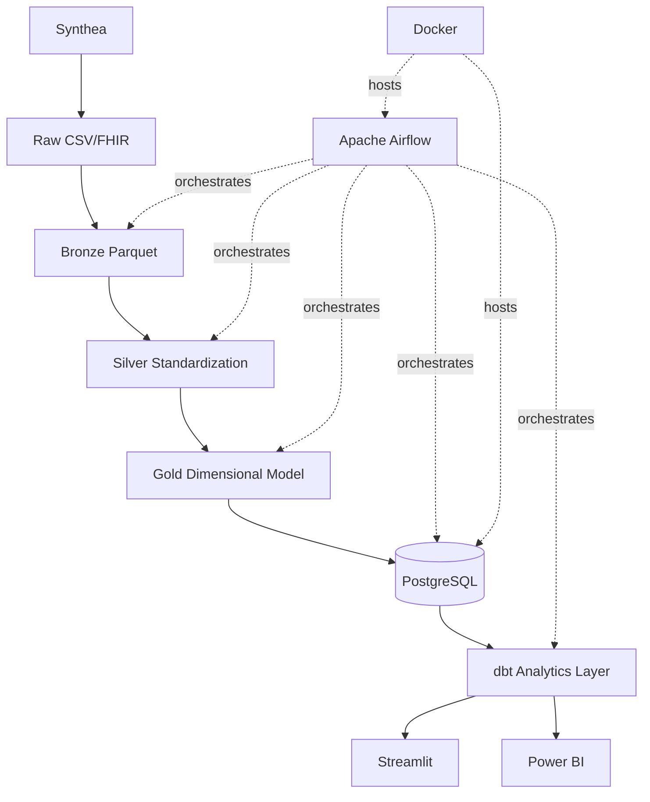

# CareFlow Analytics

### Real-Time Hospital Operations & Patient Readmission Intelligence Platform

An end-to-end healthcare analytics platform that transforms synthetic
patient and hospital data into validated analytics, dimensional
warehouse models, automated pipelines, and interactive operational
dashboards.


**Built on 100% synthetic data generated by [Synthea](https://github.com/synthetichealth/synthea)
-- no real patient data is used anywhere in this project.** See
[Security & synthetic-data note](#22-security--synthetic-data-note).

---

## Table of contents

1. [Project overview](#1-project-overview)
2. [Business problem](#2-business-problem)
3. [Key capabilities](#3-key-capabilities)
4. [Architecture](#4-architecture)
5. [Data pipeline](#5-data-pipeline)
6. [Analytics use cases](#6-analytics-use-cases)
7. [Dashboard preview](#7-dashboard-preview)
8. [Key healthcare KPIs](#8-key-healthcare-kpis)
9. [Technology stack](#9-technology-stack)
10. [Data model](#10-data-model)
11. [Data quality & testing](#11-data-quality--testing)
12. [Orchestration](#12-orchestration)
13. [Repository structure](#13-repository-structure)
14. [Quick start](#14-quick-start)
15. [Running the pipeline](#15-running-the-pipeline)
16. [Running Streamlit](#16-running-streamlit)
17. [Airflow](#17-airflow)
18. [dbt](#18-dbt)
19. [Power BI](#19-power-bi)
20. [Test results](#20-test-results)
21. [Security / synthetic-data note](#22-security--synthetic-data-note)
22. [Future improvements](#23-future-improvements)
23. [Skills demonstrated](#24-skills-demonstrated)

---

## 1. Project overview

CareFlow Analytics simulates the analytics stack a mid-size hospital
system's data team would actually build: synthetic patient data
generated by Synthea flows through a validated Bronze -> Silver -> Gold
transformation pipeline, lands in a dimensional PostgreSQL warehouse,
is tested and documented by dbt, orchestrated end-to-end by Airflow,
and delivered through both a live Streamlit dashboard and a fully
specified Power BI implementation.

Every layer is real and runnable -- this README links to the exact
commands and verified metrics (`docs/project_metrics.md`) behind every
claim it makes.

## 2. Business problem

Hospital operations, finance, and quality teams need visibility into:

- **Encounter volume** -- how many patients, how many visits, by what type
- **Emergency utilization** -- emergency department load and trend
- **Readmission trends** -- 7/14/30-day readmission rates, by segment
- **Length of stay** -- how long patients are in care
- **Healthcare costs** -- claim cost, payer coverage, patient responsibility
- **Provider utilization** -- how clinical activity is distributed
- **Patient demographics** -- population composition for planning
- **Data quality** -- whether the numbers above can be trusted at all

CareFlow Analytics builds the full data platform underneath those
questions, from raw synthetic records to interactive dashboards. **This
project does not make clinical decisions and is not a diagnostic or
care-recommendation tool** -- it is an operational/financial analytics
platform, same as a hospital's BI team would build.

## 3. Key capabilities

- Synthetic patient data generation and validation (Synthea)
- Layered transformation pipeline (Bronze/Silver/Gold) with checksum-based
  incremental processing
- Dimensional warehouse (8 dimensions, 8 facts, 6 marts) loaded into
  PostgreSQL transactionally
- Governed, tested, documented analytics layer (dbt: 36 models, 133 tests)
- End-to-end and daily-incremental orchestration (Apache Airflow, 2 DAGs)
- Interactive live dashboard (Streamlit, 7 pages)
- Fully specified Power BI implementation (data model, 39 DAX measures,
  page-by-page build guide)
- 804 automated tests across the whole stack

## 4. Architecture



Full diagram (including profiling, validation, pytest, and manifest/
checksum layers) and per-layer responsibilities:
**[`docs/architecture/architecture.md`](docs/architecture/architecture.md)**.

## 5. Data pipeline

| Stage | What happens | Docs |
|---|---|---|
| Generation | Synthea produces synthetic patients + full clinical history | [`docs/data_generation_guide.md`](docs/data_generation_guide.md) |
| Profiling & validation | Column profiling, relationship integrity, data quality rules | [`docs/data_quality_guide.md`](docs/data_quality_guide.md) |
| Bronze | Typed Parquet conversion, gated by validation | [`docs/bronze_layer_guide.md`](docs/bronze_layer_guide.md) |
| Silver | Standardization, checksum-based incremental skip | [`docs/silver_layer_guide.md`](docs/silver_layer_guide.md) |
| Gold | Dimensional star schema, deterministic keys, readmission logic | [`docs/gold_layer_guide.md`](docs/gold_layer_guide.md) |
| PostgreSQL | Transactional, incremental, checksum-based warehouse load | [`docs/postgres_warehouse_guide.md`](docs/postgres_warehouse_guide.md) |
| dbt | Governed staging -> intermediate -> mart layer, 133 tests | [`docs/dbt_analytics_guide.md`](docs/dbt_analytics_guide.md) |

Full stage-by-stage input/process/output/validation:
**[`docs/architecture/data_flow.md`](docs/architecture/data_flow.md)**.

## 6. Analytics use cases

- Executive operational reporting (encounters, cost, readmissions, at a glance)
- Readmission risk pattern analysis by segment (age group, gender, encounter class)
- Hospital operations benchmarking across organizations
- Financial performance and payer coverage analysis
- Provider utilization reporting
- Patient population demographic planning
- Pipeline/data-quality observability

Detail and interpretation examples for every use case:
**[`docs/dashboard_portfolio.md`](docs/dashboard_portfolio.md)**.

## 7. Dashboard preview

Screenshots aren't committed yet -- see
[`docs/screenshots/README.md`](docs/screenshots/README.md) for the exact
list to capture once the dashboard is running locally (this README will
link them here once they exist, not before).

Run it yourself in under a minute once the warehouse is loaded:

```bash
PYTHONPATH=src python3 scripts/start_dashboard.py
```

## 8. Key healthcare KPIs

| KPI | Live value (this dataset) |
|---|---|
| Patients served | 58 |
| Total encounters | 3,180 |
| 30-day readmission rate | ~1.4% (3 of 207 qualifying encounters) |
| Average length of stay | ~347 minutes |
| Total claim cost | $7,904,354.16 |
| Payer coverage ratio | ~77.8% |
| Active providers | 161 |

Every number above is read directly from the live warehouse/reports --
see [`docs/project_metrics.md`](docs/project_metrics.md) for the full
verified metrics list and how to regenerate them.

## 9. Technology stack

| Category | Technology |
|---|---|
| Language | Python 3.14 (main), Python 3.11 (isolated dbt/Airflow/dashboard environments) |
| Data processing | pandas, pyarrow (Parquet) |
| Database | PostgreSQL 16 |
| Analytics engineering | dbt-core, dbt-postgres |
| Orchestration | Apache Airflow 2.9 (Docker Compose) |
| Dashboard | Streamlit, Plotly |
| BI | Power BI (data model + DAX prepared; `.pbix` built separately in Power BI Desktop) |
| Containerization | Docker Compose |
| Testing | pytest (804 tests) |
| Synthetic data | Synthea |

## 10. Data model

8 dimensions, 8 facts, 6 marts -- star schema, deterministic surrogate
keys, and a documented fix for a real grain-uniqueness bug found during
development (imaging studies). Full reference:
**[`docs/architecture/warehouse_model.md`](docs/architecture/warehouse_model.md)**.

## 11. Data quality & testing

| Layer | Result |
|---|---|
| Silver data quality | 226/229 passed, 2 warnings, 1 failed *(shown honestly -- see [`docs/dashboard_portfolio.md`](docs/dashboard_portfolio.md#7-data-quality--pipeline-health))* |
| Gold data quality | 118/119 passed, 1 warning |
| PostgreSQL warehouse validation | **172/172 passed** |
| dbt tests | **133/133 passed** (121 generic + 12 singular, including 3 that reconcile dbt's independent computations against the Python Gold layer) |
| Project test suite | **804 passed, 2 skipped** (see [Test results](#21-test-results)) |

## 12. Orchestration

Two Airflow DAGs, both idempotent and retry-aware:

- **`careflow_end_to_end`** -- manual/parameterized full pipeline run (22 tasks)
- **`careflow_daily_analytics`** -- scheduled daily incremental run (11 tasks), never regenerates synthetic data

Full detail: **[`docs/airflow_orchestration_guide.md`](docs/airflow_orchestration_guide.md)**.

## 13. Repository structure

```
careflow-realtime-healthcare-analytics/
├── airflow/          # Airflow DAGs, plugins (operators, callbacks), config
├── config/            # Project configuration (project_config.yaml, SQL schema/indexes/views)
├── dashboard/          # Streamlit application (7 pages + shared components)
├── data/                # raw/bronze/silver/gold Parquet + Power BI CSV exports (gitignored except exports)
├── dbt/                  # dbt models (staging/intermediate/marts), tests, seeds, snapshots, macros
├── docs/                   # Architecture, guides, interview prep, resume/LinkedIn material
├── powerbi/                 # Power BI data model, DAX measures, theme, build guide
├── reports/                   # Generated quality/validation/run reports (tracked as evidence)
├── scripts/                    # CLI entry points for every pipeline stage
├── src/careflow/                 # Core Python package (transformation, warehouse, profiling logic)
└── tests/                          # 22 test files, 804 tests
```

## 14. Quick start

```bash
# 1. Clone the repository
git clone <this-repository-url>
cd careflow-realtime-healthcare-analytics

# 2. Create a Python environment (main project code)
python3 -m venv .venv
source .venv/bin/activate

# 3. Install dependencies
pip install -r requirements.txt

# 4. Configure environment variables
cp .env.example .env
# edit .env -- set a real POSTGRES_PASSWORD for anything beyond local dev

# 5. Start PostgreSQL
PYTHONPATH=src python3 scripts/start_postgres.py

# 6. Run the pipeline (see "Running the pipeline" below)

# 7. Validate the warehouse
PYTHONPATH=src python3 scripts/validate_postgres_warehouse.py

# 8. Run dbt (needs its own isolated environment -- see "dbt" below)

# 9. Start the dashboard (needs its own isolated environment -- see "Running Streamlit" below)

# 10. Start Airflow when you want full orchestration (see "Airflow" below)
```

## 15. Running the pipeline

```bash
PYTHONPATH=src python3 scripts/setup_synthea.py            # one-time: clone/build Synthea
PYTHONPATH=src python3 scripts/generate_synthea_data.py --population 100
PYTHONPATH=src python3 scripts/profile_synthea_data.py
PYTHONPATH=src python3 scripts/validate_synthea_data.py
PYTHONPATH=src python3 scripts/ingest_bronze.py
PYTHONPATH=src python3 scripts/build_silver_layer.py
PYTHONPATH=src python3 scripts/build_gold_layer.py
PYTHONPATH=src python3 scripts/load_postgres_warehouse.py
```

Add `--force` to `build_silver_layer.py`, `build_gold_layer.py`, or
`load_postgres_warehouse.py` to bypass their checksum-based incremental
skip and fully reprocess.

## 16. Running Streamlit

Streamlit lives in an isolated environment (`pyarrow<25` conflicts with
this project's pinned `pyarrow>=25.0`) -- see
[`docs/dashboard_guide.md`](docs/dashboard_guide.md) for the one-time
setup. Then:

```bash
PYTHONPATH=src python3 scripts/start_dashboard.py
```

## 17. Airflow

Runs via Docker Compose, behind an opt-in `airflow` profile (a plain
`docker compose up -d postgres` is unaffected):

```bash
PYTHONPATH=src python3 scripts/start_airflow.py
PYTHONPATH=src python3 scripts/trigger_careflow_dag.py --dag-id careflow_end_to_end
```

Full setup and DAG detail: [`docs/airflow_orchestration_guide.md`](docs/airflow_orchestration_guide.md).

## 18. dbt

Also isolated (dbt-core has no supported Python 3.14 build) -- see
[`docs/dbt_analytics_guide.md`](docs/dbt_analytics_guide.md) for setup. Then:

```bash
set -a && source .env && set +a
PYTHONPATH=src python3 scripts/run_dbt.py build
PYTHONPATH=src python3 scripts/run_dbt.py docs-generate
```

## 19. Power BI

Power BI Desktop is a Windows GUI application not available in every
development environment -- this project prepares everything needed to
build the report quickly rather than fabricating a `.pbix`:

- 7 CSV exports: `data/exports/powerbi/*.csv`
- Full data model, 39 DAX measures, page-by-page build guide, theme,
  and QA checklist: **[`powerbi/README.md`](powerbi/README.md)**
- End-to-end build sequence: **[`docs/powerbi_final_build_guide.md`](docs/powerbi_final_build_guide.md)**

## 20. Test results

```bash
PYTHONPATH=src python3 -m pytest -q tests/
# 804 passed, 2 skipped
```

The 2 skipped tests require `apache-airflow`/`streamlit`, which live in
isolated environments kept separate from the main Python 3.14
environment -- both run for real, with full pass results, under their
respective isolated environments (`.venv-airflow`, `.venv-dashboard`).
See [`docs/project_metrics.md`](docs/project_metrics.md) for the
per-layer test breakdown.

## 21. Security / synthetic-data note

**All data in this project is synthetic**, generated by
[Synthea](https://github.com/synthetichealth/synthea) -- no real patient
data is used, stored, or displayed anywhere in this repository. Beyond
that, the project enforces PII discipline as if the data were real: no
public model or dashboard exposes SSN, passport, driver's license,
patient name, street address, or precise latitude/longitude, checked at
three independent layers (Gold, dbt, dashboard). Full detail:
**[`docs/security.md`](docs/security.md)** and
**[`docs/data_ethics.md`](docs/data_ethics.md)**.

## 22. Future improvements

- CI/CD (automated test runs on push -- not yet configured; see [`docs/github_setup.md`](docs/github_setup.md) for repository setup that would precede it)
- Real-time/streaming ingestion (Kafka) -- explicitly out of scope for the current phase
- Machine learning readmission risk scoring -- explicitly out of scope for the current phase
- Cloud deployment (currently local Docker Compose only)
- Dedicated dimension exports for Power BI to enable organization/provider/payer cross-filtering without the current independent-marts limitation (see [`powerbi/model_relationships.md`](powerbi/model_relationships.md))

## 23. Skills demonstrated

**Data engineering:** layered ETL/ELT design, incremental/checksum-based
processing, idempotent transactional loads, dimensional modeling,
surrogate key design, composite-grain correction.

**Analytics engineering:** dbt (staging/intermediate/marts), data
testing, documentation-as-code, source freshness, independent
reconciliation between two computation paths.

**Orchestration:** Apache Airflow DAG design, custom operators,
callbacks, idempotency, retry strategy, environment isolation.

**Data warehousing:** PostgreSQL schema design, transactional bulk
loading, star schema, SQL performance (COPY, indexing).

**Analytics/BI:** Streamlit application development, Plotly
visualization, DAX measure design, Power BI data modeling.

**Software engineering:** Python packaging, comprehensive automated
testing (804 tests), Docker Compose, secrets management, PII-safe
system design, technical documentation.

---

*Questions about this project? See [`docs/interview_guide.md`](docs/interview_guide.md)
for detailed technical explanations of every major design decision.*
