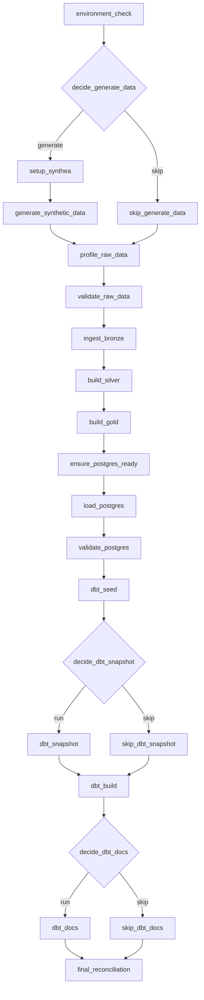
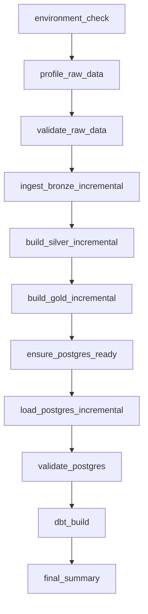

# Airflow Workflow

Task graphs for both DAGs, generated directly from
`airflow/dags/careflow_end_to_end.py` and
`airflow/dags/careflow_daily_analytics.py` -- every node and edge below
matches the `>>` dependency wiring in those files.

## `careflow_end_to_end` (manual/parameterized, full pipeline)

22 tasks total. `decide_generate_data`, `decide_dbt_snapshot`, and
`decide_dbt_docs` are branch operators driven by DAG run parameters
(`generate_data`, `run_dbt_snapshot`, `run_dbt_docs`) -- every branch
converges back onto the main path via an `EmptyOperator` skip stub, so
the DAG has exactly one linear critical path regardless of which
branches are taken. Trigger with parameters via
`scripts/trigger_careflow_dag.py` (see
[`docs/airflow_orchestration_guide.md`](../airflow_orchestration_guide.md)).

## `careflow_daily_analytics` (scheduled, incremental-only)

11 tasks, no branching -- this DAG never regenerates synthetic data and
never touches `setup_synthea`/`generate_synthetic_data`; it only
re-runs the checksum/dependency-signature-gated incremental path, so a
scheduled run that finds nothing changed completes as a fast no-op
rather than reprocessing the whole warehouse.

## Design properties (both DAGs)

- **Idempotent** -- every task can be safely re-run; Bronze/Silver/Gold/
  PostgreSQL stages skip unchanged data via checksums/dependency
  signatures, and `--force`/`--truncate-and-load` variants exist for an
  explicit full reprocess.
- **Retry-aware** -- custom operators (`airflow/plugins/careflow_operators.py`)
  and callbacks (`airflow/plugins/careflow_callbacks.py`) sanitize
  driver exceptions before logging and surface real task failures
  rather than absorbing them into a summary task.
- **PII-safe run summaries** -- `reports/airflow/airflow_run_summary.json`
  and `airflow_task_summary.csv` never contain patient-identifying data.
- **Environment-isolated** -- the scheduler/webserver run in Docker
  (`docker-compose.yml`'s `airflow` profile); every task shells out to
  the same CLI scripts a developer would run by hand, so Airflow never
  reimplements pipeline logic.

## See also

- [`architecture.md`](architecture.md) -- overall system diagram
- [`data_flow.md`](data_flow.md) -- stage-by-stage input/process/output/validation
- [`../airflow_orchestration_guide.md`](../airflow_orchestration_guide.md) -- full setup, DAG parameters, and the two real bugs found/fixed during this phase
