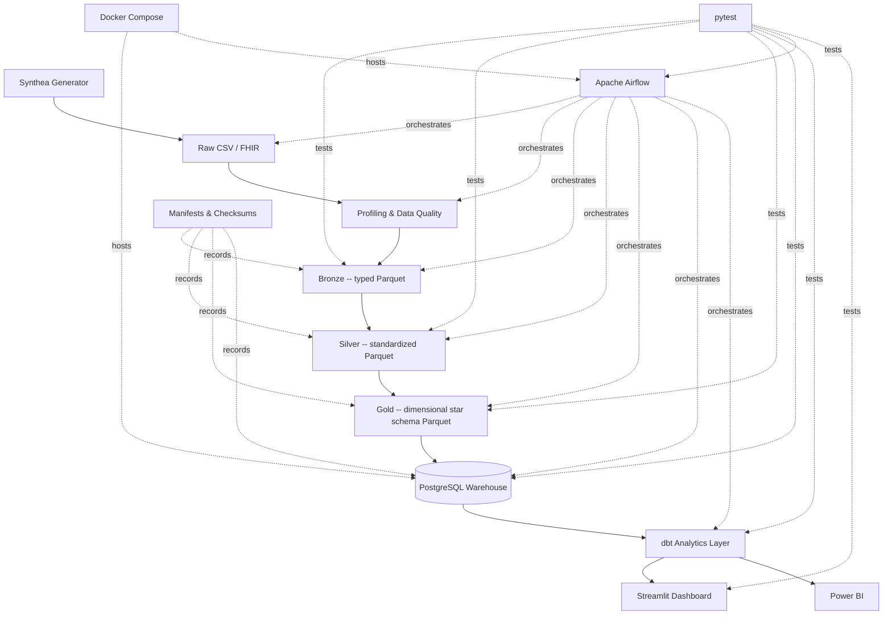

# Architecture

CareFlow Analytics is a layered healthcare analytics platform: synthetic
patient data flows through progressively more refined, validated
transformation layers, lands in a governed PostgreSQL warehouse, is
tested and documented by dbt, orchestrated end-to-end by Airflow, and
surfaced through interactive dashboards. Every layer only reads from
the layer directly below it -- there is no layer that reaches back
upstream or skips ahead.

## Full pipeline

Every box in this diagram is a real, working component in this
repository -- nothing here is aspirational. See `docs/project_metrics.md`
for verified row/table/test counts at every stage.

## Layer responsibilities

| Layer | Reads from | Writes to | Responsibility |
|---|---|---|---|
| **Synthea** | -- | `data/raw/synthea/` | Generates synthetic patients, encounters, conditions, procedures, medications, claims, and more, as CSV (and optionally FHIR) |
| **Profiling & Data Quality** | `data/raw/` | `reports/profiling/` | Column-level profiling, relationship integrity checks, data quality rules -- the gate Bronze ingestion checks before promoting a file |
| **Bronze** | `data/raw/` (gated by profiling) | `data/bronze/*.parquet` | Typed Parquet conversion, one file per source table, with a manifest recording row counts, schema, and checksums |
| **Silver** | `data/bronze/` | `data/silver/*.parquet` | Standardization: consistent types, cleaned categorical values, derived fields, checksum-based incremental skip |
| **Gold** | `data/silver/` | `data/gold/*.parquet` | Dimensional star schema (8 dimensions, 8 facts, 6 marts), deterministic surrogate keys, readmission logic, checksum-based incremental skip |
| **PostgreSQL warehouse** | `data/gold/` | `careflow_dim`/`careflow_fact`/`careflow_mart` schemas | Transactional, incremental, checksum-based load; whole-batch transactional force-reload; validated against Gold's own outputs |
| **dbt** | PostgreSQL `careflow_dim`/`careflow_fact`/`careflow_mart` | `careflow_dbt_staging`/`careflow_dbt_intermediate`/`careflow_dbt_mart` | Governed, tested, documented staging -> intermediate -> mart layer; 133 tests; independent readmission/financial reconciliation against the Python Gold layer |
| **Airflow** | -- (orchestrates the above) | -- | Two DAGs: a full parameterized end-to-end run, and a daily incremental run; idempotent, retry-aware, PII-safe run summaries |
| **Streamlit dashboard** | `careflow_dbt_mart` (PostgreSQL) | -- (read-only) | 7 interactive pages: Executive, Readmission, Operations, Financial, Provider, Patient Population, Data Quality |
| **Power BI** | `data/exports/powerbi/*.csv` (from `careflow_dbt_mart`) | -- | Fully specified (data model, DAX, page-by-page build guide) for a Power BI Desktop build |

## Environment isolation

Three tools in this stack (dbt, Airflow, Streamlit) have Python version
or dependency constraints incompatible with the project's main Python
environment (Python 3.14) or its pinned `pyarrow>=25.0`. Rather than
compromise the main environment, each lives in its own isolated
virtualenv, never touching the others:

| Tool | Environment | Why isolated |
|---|---|---|
| Bronze/Silver/Gold/PostgreSQL scripts | Main Python (3.14) | The project's own code, no conflicting constraints |
| dbt | `.venv-dbt` (Python 3.11) | dbt-core has no supported Python 3.14 build |
| Airflow | `.venv-airflow` (Python 3.11, test-only) + Docker (runtime) | apache-airflow has no supported Python 3.14 build; Docker keeps the actual scheduler/webserver fully isolated from the host |
| Streamlit dashboard | `.venv-dashboard` (Python 3.11) | streamlit requires `pyarrow<25`, which would downgrade the project's pinned `pyarrow>=25.0` |

See `docs/dbt_analytics_guide.md`, `docs/airflow_orchestration_guide.md`,
and `docs/dashboard_guide.md` for exact setup commands.

## See also

- `docs/architecture/data_flow.md` -- stage-by-stage input/process/output/validation
- `docs/architecture/warehouse_model.md` -- the dimensional model in detail
- `docs/project_metrics.md` -- verified counts at every layer
