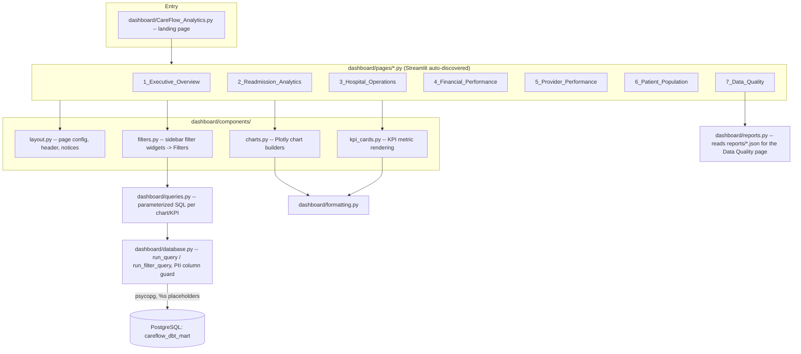

# Dashboard Architecture

The Streamlit dashboard is a thin, read-only presentation layer -- it
never writes to the warehouse, never bypasses parameterized SQL, and
never queries anything outside `careflow_dbt_mart`.

## Layer responsibilities

| Layer | File(s) | Responsibility |
|---|---|---|
| Entry point | `CareFlow_Analytics.py` | Landing page; Streamlit auto-discovers `pages/*.py` for sidebar navigation |
| Pages | `pages/1..7_*.py` | One page per analytics use case; compose filters + queries + charts/KPI cards -- no raw SQL lives here |
| Filters | `components/filters.py` | Sidebar widgets (date range, organization, age group, gender, encounter class) build a single `Filters` object passed into every query function |
| Queries | `queries.py` | One function per chart/KPI (e.g. `get_readmission_kpis`, `get_encounter_volume_by_month`); every query is parameterized (`%s` placeholders), never string-interpolated |
| Database | `database.py` | `run_query`/`run_filter_query` execute through `careflow.warehouse.postgres_client`; `assert_no_restricted_columns` blocks any accidental PII column from ever reaching a page |
| Charts / KPI cards | `components/charts.py`, `components/kpi_cards.py` | Plotly figure construction and KPI metric rendering, reused across pages |
| Formatting | `formatting.py` | Shared number/date/currency formatting |
| Reports | `reports.py` | Reads pipeline JSON/CSV reports (`reports/profiling/`, `reports/warehouse/`, `reports/dbt/`, `reports/airflow/`) for the Data Quality page -- the only page that doesn't query PostgreSQL |

## Security properties

- **No PII surfaces**: `assert_no_restricted_columns` runs on every
  query result; a query that returns a restricted column (SSN,
  passport, driver's license, name, street address, precise lat/long)
  raises `RestrictedColumnError` instead of rendering. Covered by
  `tests/test_dashboard_security.py`.
- **No SQL injection surface**: every query in `queries.py` passes
  filter values as parameters, never by string formatting into the SQL
  text.
- **Read-only**: the dashboard never issues `INSERT`/`UPDATE`/`DELETE`;
  all writes happen upstream, in the Bronze/Silver/Gold/PostgreSQL
  pipeline stages.
- **Environment-isolated**: runs in `.venv-dashboard` (Python 3.11)
  because streamlit requires `pyarrow<25`, which conflicts with the
  main project's `pyarrow>=25.0` pin -- see
  [`../dashboard_guide.md`](../dashboard_guide.md).

## See also

- [`architecture.md`](architecture.md) -- overall system diagram
- [`../dashboard_guide.md`](../dashboard_guide.md) -- setup and page-by-page detail
- [`../dashboard_portfolio.md`](../dashboard_portfolio.md) -- use-case walkthroughs and interpretation examples
