# Data Flow

Every stage below, in pipeline order. Each includes what it reads
(Input), what it does (Process), what it produces (Output), and how
it's checked (Validation). Commands are copy-pasteable and match what
`airflow/dags/careflow_end_to_end.py` itself runs.

```mermaid
flowchart LR
    A[1\. Synthea] --> B[2\. Raw Dataset]
    B --> C[3\. Profiling]
    C --> D[4\. Relationship Validation]
    D --> E[5\. Bronze Ingestion]
    E --> F[6\. Silver Transformation]
    F --> G[7\. Gold Modeling]
    G --> H[8\. PostgreSQL Warehouse]
    H --> I[9\. dbt Modeling]
    I --> J[10\. Orchestration]
    J --> K[11\. Analytics Delivery]
```

## 1. Synthea generation

- **Input:** population size, state, seed (`config/project_config.yaml`'s `data_generation.synthea` block)
- **Process:** clones/builds Synthea (`scripts/setup_synthea.py`), then runs it to generate synthetic patients and their full clinical history (`scripts/generate_synthea_data.py`)
- **Output:** `data/raw/synthea/csv/*.csv` (18 files), `data/raw/synthea/generation_manifest.json`
- **Validation:** generation manifest records population size, seed, and file checksums

## 2. Raw dataset

- **Input:** `data/raw/synthea/csv/*.csv`
- **Process:** no transformation -- this is the landing zone, read-only from every downstream stage
- **Output:** unchanged CSVs
- **Validation:** none at this stage (validation begins at profiling); raw files are never modified by any later stage (verified by checksum-comparison tests)

## 3. Profiling

- **Input:** `data/raw/synthea/csv/*.csv`
- **Process:** column-level profiling (types, null rates, cardinality, value distributions) (`scripts/profile_synthea_data.py`)
- **Output:** `reports/profiling/dataset_profile.json`, `column_profile.csv`
- **Validation:** profiling is itself descriptive, not pass/fail -- it feeds the data quality and relationship checks below

## 4. Relationship & data quality validation

- **Input:** `data/raw/synthea/csv/*.csv`
- **Process:** referential integrity checks (e.g. every `encounters.PATIENT` resolves to a `patients.Id`), plus rule-based data quality checks (critical-column completeness, cost-field sanity, UUID format, ZIP format) (`scripts/validate_synthea_data.py`)
- **Output:** `reports/profiling/relationship_summary.json`, `data_quality_report.json`, `data_quality_summary.csv`, `failed_record_samples.json`
- **Validation:** warning/fail thresholds configured in `config/project_config.yaml`'s `data_quality` block; this is the gate Bronze ingestion checks before promoting a file

## 5. Bronze ingestion

- **Input:** `data/raw/synthea/csv/*.csv`, gated by the validation reports above
- **Process:** typed Parquet conversion, chunked streaming (never loading a full file into memory at once); any file with a blocking rule/relationship failure is skipped, not ingested (`scripts/ingest_bronze.py`)
- **Output:** `data/bronze/*.parquet`, `data/bronze/bronze_manifest.json` (per-file row counts, schema, checksums)
- **Validation:** the manifest itself is the validation record; re-running profiling/relationship checks refreshes the gate on every ingestion run
- **Command:** `PYTHONPATH=src python3 scripts/ingest_bronze.py`

## 6. Silver transformation

- **Input:** `data/bronze/*.parquet`
- **Process:** standardization -- consistent types across datasets, cleaned categorical values, derived fields (e.g. age at reference date), checksum-based skip when a Bronze file hasn't changed (`scripts/build_silver_layer.py`)
- **Output:** `data/silver/*.parquet`, `data/silver/silver_manifest.json`, `reports/profiling/silver_quality_report.json`
- **Validation:** 229 Silver data quality checks (`silver_quality_report.json`)
- **Command:** `PYTHONPATH=src python3 scripts/build_silver_layer.py` (`--force` to bypass the checksum skip)

## 7. Gold modeling

- **Input:** `data/silver/*.parquet`
- **Process:** dimensional star-schema modeling -- 8 dimensions, 8 facts, 6 pre-aggregated marts; deterministic surrogate keys; independently computed 7/14/30-day readmission logic; dependency-signature-based incremental skip (`scripts/build_gold_layer.py`)
- **Output:** `data/gold/*.parquet`, `data/gold/gold_manifest.json`, `reports/profiling/gold_quality_report.json`, `gold_kpi_summary.json`
- **Validation:** 119 Gold data quality checks (`gold_quality_report.json`)
- **Command:** `PYTHONPATH=src python3 scripts/build_gold_layer.py` (`--force` to bypass the incremental skip)

## 8. PostgreSQL warehouse

- **Input:** `data/gold/*.parquet`
- **Process:** bulk `COPY` load (never row-by-row `INSERT`) into a staged, unlogged table; row-count validated; atomically swapped into the target table inside one transaction. A plain run skips tables whose Gold checksum is unchanged; `--force` performs a whole-batch transactional clear-then-reload (clear marts, then facts, then dimensions; reload dimensions, then facts, then marts) so it can never trip a foreign-key violation on a repeated force run (`scripts/load_postgres_warehouse.py`)
- **Output:** `careflow_dim.*`, `careflow_fact.*`, `careflow_mart.*` tables in PostgreSQL; `reports/warehouse/postgres_load_report.json`
- **Validation:** 172 checks comparing live PostgreSQL state back to Gold's own outputs (`scripts/validate_postgres_warehouse.py` -> `postgres_validation_report.json`)
- **Commands:** `PYTHONPATH=src python3 scripts/start_postgres.py`, then `scripts/load_postgres_warehouse.py`, then `scripts/validate_postgres_warehouse.py`

## 9. dbt modeling

- **Input:** PostgreSQL `careflow_dim`/`careflow_fact`/`careflow_mart`
- **Process:** staging (1:1 from sources, explicit columns, no PII) -> intermediate (joins, window functions, independently recomputed readmissions) -> marts (consumer-facing, PII-safe, tables/incremental)
- **Output:** `careflow_dbt_staging.*`, `careflow_dbt_intermediate.*`, `careflow_dbt_mart.*` (36 models); `reports/dbt/*`
- **Validation:** 133 dbt tests (121 generic + 12 singular), including three that reconcile dbt's independently-computed figures against the Python Gold layer's own output within explicit numeric tolerances
- **Command:** `PYTHONPATH=src python3 scripts/run_dbt.py build`

## 10. Orchestration

- **Input:** every stage above, as subprocess calls -- Airflow never reimplements their logic
- **Process:** `careflow_end_to_end` (manual/parameterized, full pipeline) and `careflow_daily_analytics` (scheduled daily, incremental-only, never regenerates synthetic data) DAGs, both idempotent and retry-aware
- **Output:** `reports/airflow/airflow_run_summary.json`, `airflow_task_summary.csv`
- **Validation:** every task's own validation step (Silver/Gold quality, PostgreSQL validation, dbt tests) runs as part of the DAG; a failed task fails the DAG run itself (not silently absorbed by the summary task)
- **Command:** `PYTHONPATH=src python3 scripts/start_airflow.py`, then `scripts/trigger_careflow_dag.py`

## 11. Analytics delivery

- **Input:** `careflow_dbt_mart` (PostgreSQL), plus the pipeline reports above for the Data Quality page
- **Process:** Streamlit dashboard (live queries, parameterized, PII-checked) and Power BI (CSV export + documented model/measures/pages)
- **Output:** interactive dashboards; `data/exports/powerbi/*.csv`
- **Validation:** `tests/test_dashboard_security.py` (PII exclusion, SQL parameterization), `tests/test_powerbi_exports.py` (export integrity, reconciliation)
- **Command:** `PYTHONPATH=src python3 scripts/start_dashboard.py`

## See also

- `docs/architecture/architecture.md` -- the overall system diagram
- `docs/architecture/warehouse_model.md` -- the dimensional model in detail
