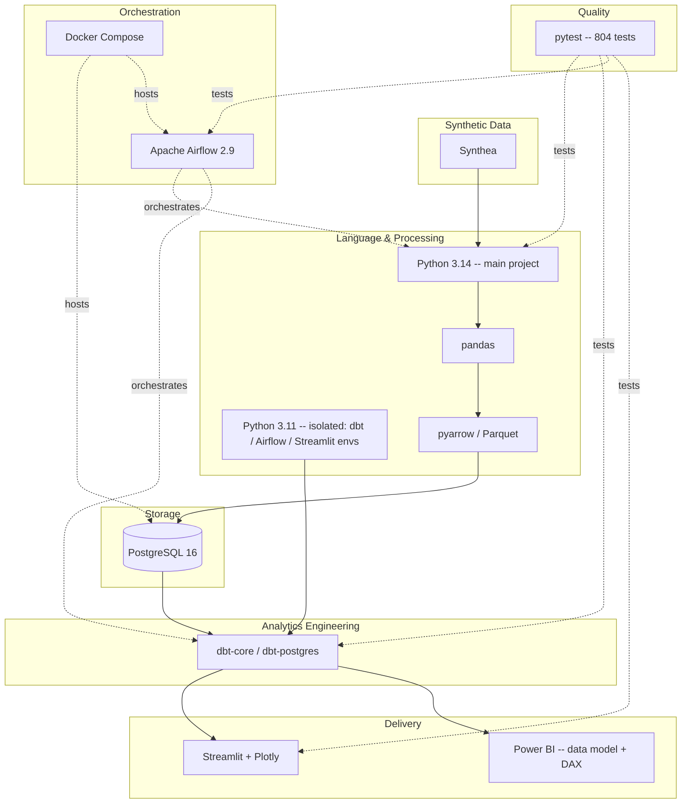

# Technology Stack

How each technology fits together, layered from data generation through
delivery. See [`../../README.md`](../../README.md#9-technology-stack)
for the flat version-by-version table.

## Why each choice

| Technology | Why this one |
|---|---|
| **Python** | The main pipeline (Bronze/Silver/Gold, profiling, validation) needs general-purpose data manipulation (pandas) and typed columnar storage (pyarrow/Parquet) -- a natural fit over SQL-only tooling for this stage. |
| **PostgreSQL** | A real relational warehouse with transactional guarantees (atomic staged-table swaps), foreign keys, and indexing -- closer to what a hospital data team would actually run than a file-based warehouse. |
| **dbt** | Separates "how the warehouse is loaded" (Python) from "how it's governed, tested, and documented for analytics" (SQL + YAML) -- and its test framework enables the independent reconciliation tests that catch divergence between the Python Gold layer and dbt's own recomputation. |
| **Apache Airflow** | Industry-standard orchestrator; DAG dependency/branching semantics map directly onto the pipeline's real conditional steps (skip data generation, skip dbt snapshot/docs) without hand-rolled scripting. |
| **Docker Compose** | Isolates PostgreSQL and the Airflow scheduler/webserver from the host, with named volumes for persistence and an opt-in `airflow` profile so `docker compose up -d postgres` alone stays lightweight. |
| **Streamlit** | Fast to build a real, live, filterable dashboard in pure Python -- no separate frontend build step, while still enforcing the same parameterized-SQL and PII-column discipline as the rest of the stack. |
| **Power BI** | The BI tool most enterprise healthcare/hospital analytics teams standardize on; prepared fully (data model, DAX, page build guide) even though the `.pbix` itself is built in the Windows-only Power BI Desktop application, not fabricated here. |
| **pytest** | One test runner across every layer -- transformation logic, warehouse loading, dbt project structure, Airflow DAG structure/callbacks, and dashboard security -- so the whole stack has one command to verify it (`PYTHONPATH=src python3 -m pytest -q tests/`). |

## Environment isolation, at a glance

| Component | Environment | Constraint that forced isolation |
|---|---|---|
| Bronze/Silver/Gold/PostgreSQL scripts | Main Python 3.14 | None -- the project's own code |
| dbt | `.venv-dbt` (Python 3.11) | dbt-core has no supported Python 3.14 build |
| Airflow | `.venv-airflow` (Python 3.11, test-only) + Docker (runtime) | apache-airflow has no supported Python 3.14 build |
| Streamlit dashboard | `.venv-dashboard` (Python 3.11) | streamlit requires `pyarrow<25`, conflicting with the project's pinned `pyarrow>=25.0` |

## See also

- [`architecture.md`](architecture.md) -- overall system diagram
- [`../../README.md`](../../README.md#9-technology-stack) -- version table
