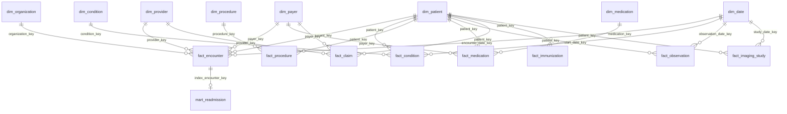

# Warehouse Model

The Gold layer (and, one-for-one, the PostgreSQL warehouse it loads) is
a dimensional star schema: 8 dimensions, 8 facts, and 6 pre-aggregated
marts. This document is the model reference; `docs/gold_layer_guide.md`
covers how it's built, and `docs/postgres_warehouse_guide.md` covers
how it's loaded.

## Star schema

## Dimensions

| Table | Grain | Primary key | Notes |
|---|---|---|---|
| `dim_patient` | one row per patient | `patient_key` | Restricted PII (SSN, passport, driver's license, first/middle/last name, street address) is dropped here -- never carried past Gold |
| `dim_provider` | one row per provider | `provider_key` | |
| `dim_organization` | one row per organization | `organization_key` | |
| `dim_payer` | one row per payer | `payer_key` | |
| `dim_date` | one row per calendar day | `date_key` (`YYYYMMDD` integer) | Spans the full range needed by the fact tables (Synthea generates full patient life histories, so this goes back decades -- see `docs/project_metrics.md`) |
| `dim_condition` | one row per distinct condition code | `condition_key` | |
| `dim_procedure` | one row per distinct procedure code | `procedure_key` | |
| `dim_medication` | one row per distinct medication code | `medication_key` | |

## Facts

| Table | Grain | Primary key | Notes |
|---|---|---|---|
| `fact_encounter` | one row per encounter | `encounter_key` | The central fact table -- almost every mart and dashboard KPI aggregates from here |
| `fact_condition` | one row per condition diagnosis event | `condition_event_key` | |
| `fact_procedure` | one row per procedure event | `procedure_event_key` | |
| `fact_medication` | one row per medication event | `medication_event_key` | |
| `fact_observation` | one row per clinical observation | `observation_key` | The largest fact table (28,089 rows -- see `docs/project_metrics.md`) |
| `fact_claim` | one row per claim | `claim_key` | |
| `fact_immunization` | one row per immunization event | `immunization_key` | |
| `fact_imaging_study` | one row per imaging study **series/instance** | `imaging_study_key` (deterministic hash) | **See "Imaging study composite-grain correction" below -- this table's grain is not what the raw source data implies** |

## Marts (pre-aggregated, consumer-facing)

| Table | Grain | Primary key | Notes |
|---|---|---|---|
| `mart_patient_360` | one row per patient | `patient_key` | Patient-level rollup: encounter/condition/procedure/medication counts |
| `mart_readmission` | one row per qualifying index encounter | `index_encounter_key` | 7/14/30-day readmission flags; the reconciliation baseline dbt's independent readmission computation is checked against |
| `mart_hospital_operations` | one row per organization x encounter date x encounter class | `(organization_key, encounter_date_key, encounter_class)` | Composite key -- no single-column primary key exists at this grain |
| `mart_financial_performance` | one row per payer x organization x month | `(payer_key, organization_key, year_month)` | |
| `mart_provider_utilization` | one row per provider x month | `(provider_key, year_month)` | |
| `mart_monthly_kpis` | one row per month | `year_month` | Hospital-wide monthly KPI summary -- the same grain `mart_executive_monthly` (dbt layer) and `executive_monthly.csv` (Power BI export) use |

## Imaging study composite-grain correction

`fact_imaging_study`'s source data (Synthea's `imaging_studies.csv`)
has a subtlety that mattered for correct key design: the source `Id`
column is **not** row-unique -- a single imaging study can have
multiple series, and each series can have multiple instances, all
sharing the same `Id`. Treating `Id` as the row-level primary key would
have silently collapsed multiple real rows onto one key (or, depending
on load order, thrown a duplicate-key error).

The fix: `imaging_study_key` is a deterministic hash of the **composite**
`(study_id, series_uid, instance_uid)` -- the true row grain -- not
`study_id` alone. This is enforced at three layers, each independently:

1. **Gold** builds the surrogate key from the composite, not `Id` alone.
2. **dbt** never tests `study_id` alone as unique (there's an explicit
   comment in `dbt/models/staging/stg_careflow__imaging_studies.sql`
   and its schema.yml saying so) -- instead,
   `dbt_utils.unique_combination_of_columns` on
   `(study_id, series_uid, instance_uid)` is the enforced grain test,
   and a singular test (`imaging_study_composite_grain_is_unique.sql`)
   double-checks it.
3. **Power BI documentation** (`powerbi/data_dictionary.md`) repeats
   the same warning for anyone building the model from the CSV exports.

This is one of the concrete data-modeling bugs found and fixed during
this project -- see `docs/interview_guide.md` for the full story and an
interview-ready explanation.

## Relationships summary

Every fact table relates to `dim_date` on at least one date key (the
specific column varies -- `encounter_date_key`, `start_date_key`,
`study_date_key`, etc.) and to `dim_patient` on `patient_key`. Facts
never relate directly to each other -- `mart_readmission` is the one
exception, relating to `fact_encounter` on `index_encounter_key` (a
mart-to-fact relationship, not fact-to-fact). This mirrors the same
"avoid unnecessary many-to-many relationships" discipline documented for
the Power BI model in `powerbi/model_relationships.md`.

## See also

- `docs/architecture/architecture.md` -- the overall system diagram
- `docs/gold_layer_guide.md` -- how this model is built
- `docs/postgres_warehouse_guide.md` -- how it's loaded into PostgreSQL
- `docs/dbt_analytics_guide.md` -- the governed reporting layer built on top of it
